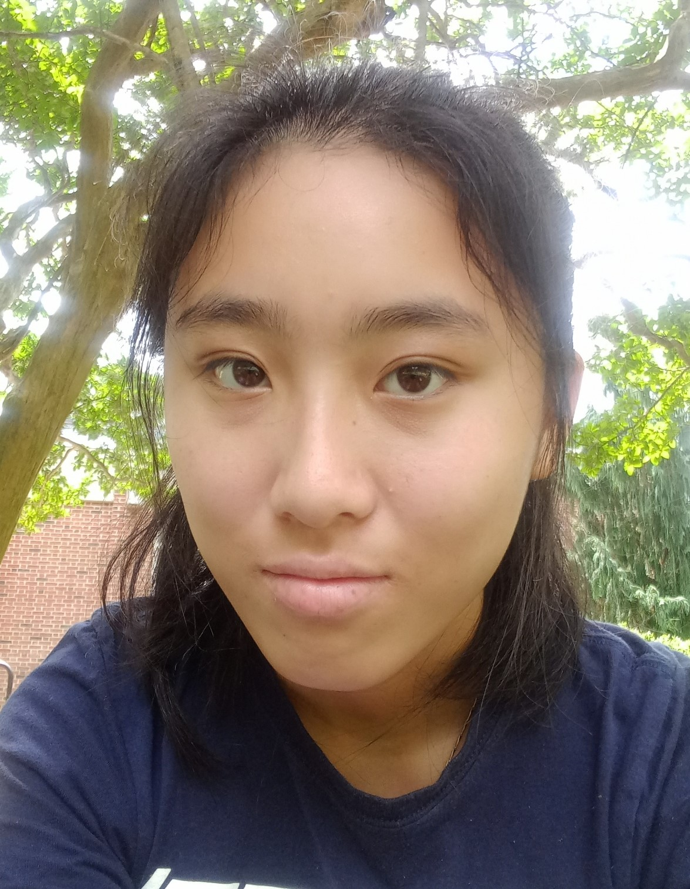

# About Me

Greetings! I am an undergraduate student at William & Mary studying data science and computer science. Over time, I have developed skills and interests in data analysis and storytelling, machine learning, natural language processing, and software development. I thrive on tackling challenges and finding innovative solutions that make a positive impact.

✉️ Email: cynthia.xiong@outlook.com  
LinkedIn: [https://www.linkedin.com/in/xiong-cynthia](https://www.linkedin.com/in/xiong-cynthia)  
Github: [https://github.com/XiongCynthia](https://github.com/XiongCynthia)

 

---

# Projects

## Applied Machine Learning/Natural Language Processing

- [Sensor Fault Detection](https://xiongcynthia.github.io/SensorFaultDetection/): A performance analysis of predictive models for sensor fault detection, using statistical  methods, machine learning algorithms, and deep learning networks.
- [Insights of the Lotus](https://xiongcynthia.github.io/LotusInsights/): Unraveling the Buddhist text, the Lotus Sutra, through topic modeling and network analysis.
- [HyperTune CIFAR](https://github.com/XiongCynthia/HyperTuneCIFAR/blob/main/HyperTuneCIFAR.ipynb): Hyperparameter tuning on AlexNet for CIFAR-10 image classification using grid search.
- [Decoding YouTube Comments](https://xiongcynthia.github.io/Decoding-YouTube-Comments): Creating a novel dataset by collecting relevant YouTube video data, and researching methods for uncovering insights from the video comments using sentiment analysis and topic modeling techniques.
- [ML with Sentimental Tomatoes](https://xiongcynthia.github.io/ML-with-Sentimental-Tomatoes): Predicting sentiment scores of movie reviews with EDA, feature engineering, and logistic regression/naïve Bayes models.
- [Titanic - Machine Learning from Disaster](https://github.com/XiongCynthia/Titanic-Machine-Learning-from-Disaster/blob/main/titantic_survivor_predictor.ipynb): Predicting passenger survivor status with EDA, data cleansing and feature engineering.

## Machine Learning Algorithms

- [RidgeRegression](https://xiongcynthia.github.io/RidgeRegression): An implementation of a Ridge regression model for fitting and predicting data.
- [Lowess](https://xiongcynthia.github.io/Lowess): An implementation of a LOWESS model for fitting and predicting data.
- [RegressionTree](https://xiongcynthia.github.io/RegressionTree): An implmentation of a regression tree for fitting and predicting data.
- [GradientBoostedLowess](https://xiongcynthia.github.io/GradientBoostedLowess): An implementation of gradient boosting on the LOWESS model for fitting and predicting data.
- [KNearestNeighborsClassifier](https://xiongcynthia.github.io/KNearestNeighborsClassifier): An implementation of a k-nearest neighbors classifier for fitting and predicting data.
- [KNearestNeighbors](https://xiongcynthia.github.io/KNearestNeighbors): An implementation of the k-nearest neighbors method.
- [SCADRegression](https://xiongcynthia.github.io/SCADRegression): An implementation of a linear model with SCAD penalty for fitting and predicting data.

## Data Structures
- [Linked_List](https://xiongcynthia.github.io/Literally-Loving-Linked-Lists): An implementation of a sentineled, doubly linked list.
- [Binary_Search_Tree](https://xiongcynthia.github.io/Its-a-Jump-and-a-Step-in-the-AVL-Tree): An implementation of a self-balancing binary search tree.
- [Stack, Queue, and Deques](https://xiongcynthia.github.io/Queue-the-Stacking-of-the-Deque): Implementations of a stack, a queue, and two unique deques.
